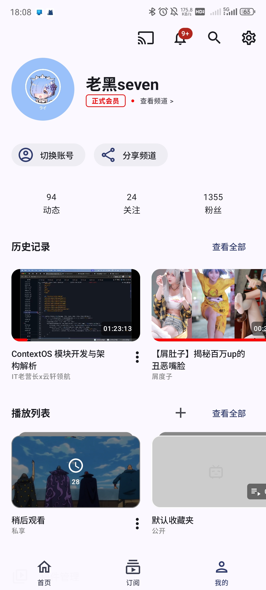
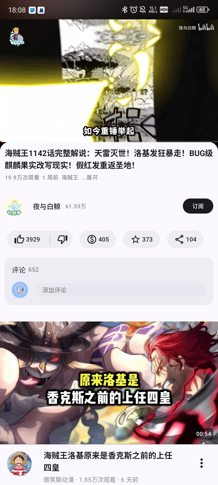
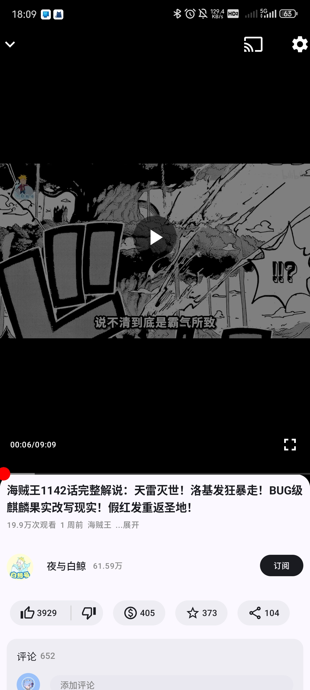
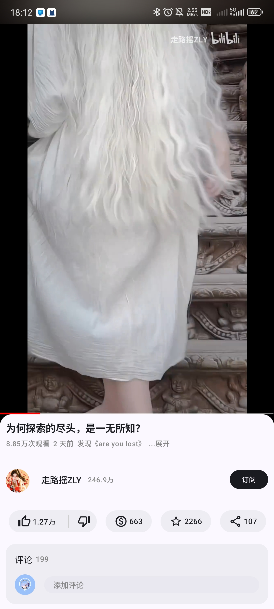
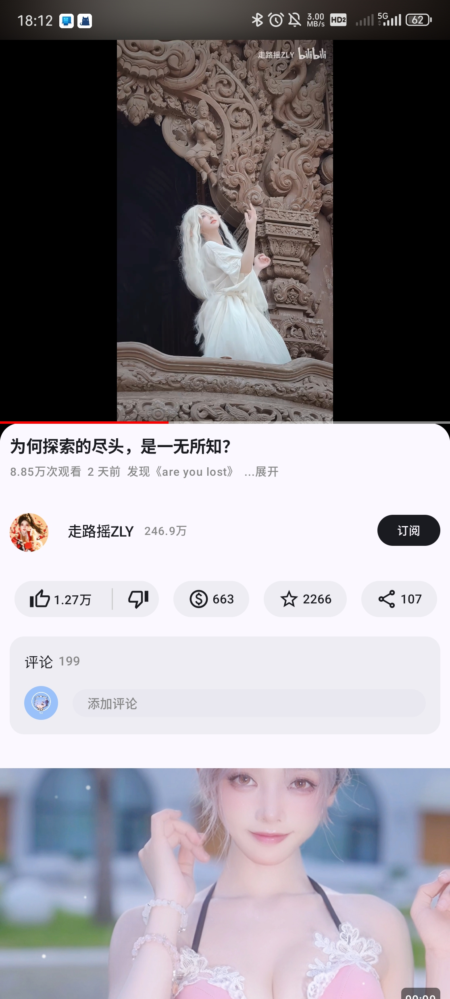
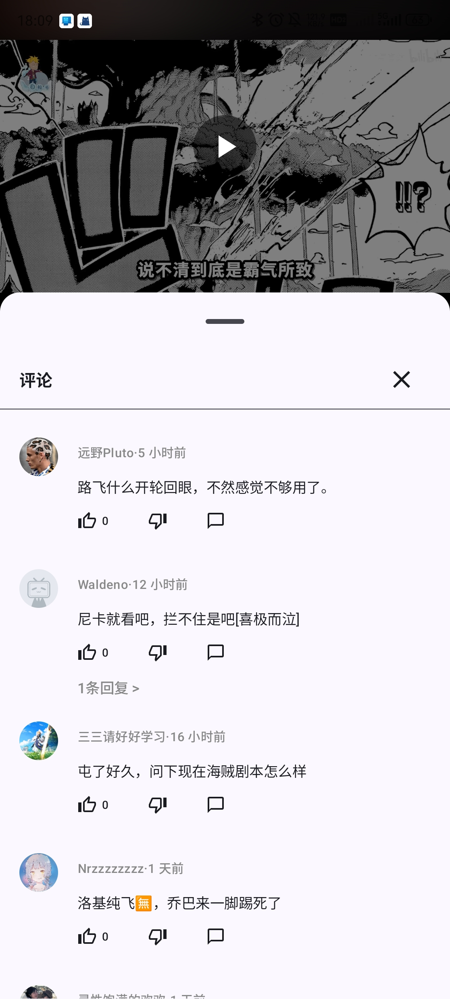
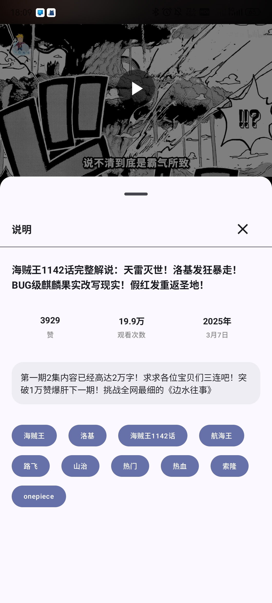
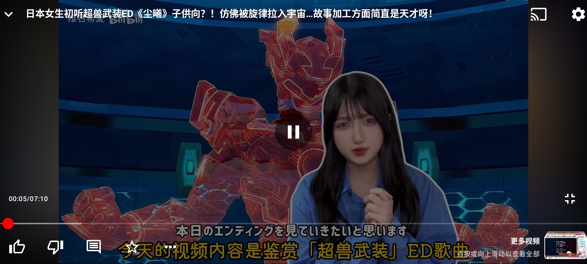
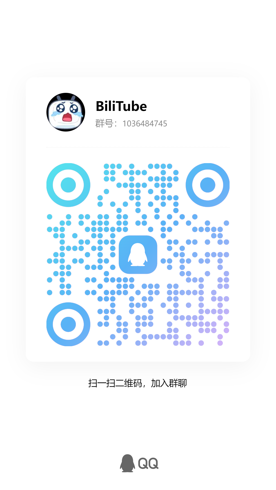

    

<h1 align="center">BiliTube</h1>

本项目旨在学习 `B站` 和 `YouTube` 客户端 UI

::: warning ⚠️声明

1. 本项目遵守 CC-BY-NC 4.0 协议，禁止一切商业使用，如需转载请注明作者 ID
2. **请勿滥用，本项目仅用于学习和测试！请勿滥用，本项目仅用于学习和测试！请勿滥用，本项目仅用于学习和测试！**
3. 利用本项目提供的接口、文档等造成不良影响及后果与本人无关
4. 由于本项目的特殊性，可能随时停止开发或删档
5. 本项目为开源项目，不接受任何形式的催单和索取行为，更不容许存在付费内容
6. **上传任何信息时请注意脱敏，删去账户密码、敏感 cookies 等可能泄漏个人信息的数据（例如 `SESSDATA`、`bili_jct` 之类的 cookies）**

## 预览

    
    
    
    
    
    
    
    
    
    
    
    
    

## 技术栈

🚀 核心框架：Android Compose、Material 3
💾 数据存储：DataStore、SharedPreferences
📄 分页加载：Paging 3
🌐 网络通信：Ktor + Kotlin Serialization
🖼️ 图片加载：Coil 3
🧭 导航管理：Navigation
🛠️ 依赖注入：Koin
📹 多媒体支持：Media3（视频播放器）
🔳 二维码处理：ZXing

## 说明

- 该项目以 UI 为主，数据来源请自行获取 **（请严格遵守网络安全）**
- sdk 模块中 model 包下为 AI 生成的实体类（比较杂乱）；model_v2 为整理后的实体类（只保留展示的数据部分）。

## 项目进度

### V1.0

- [x] 推荐页
- [x] 热门页
- [x] 视频播放（横屏、竖屏）
- [x] 视频相关推荐
- [x] 视频评论
- [x] 视频信息
- [x] 扫码登陆
- [x] 动态
- [x] 个人页面（播放列表、历史记录、关注、粉丝、动态数据）

## 💦交流

⚠注意：开源社群欢迎交流探讨，**拒绝**咨询、**不支持**合作，**黑产号**一经发现立即拉黑并举报相关 SRC

- [QQ 交流群1](https://qm.qq.com/q/lgnFYGDHOM)

## 发电

大家的支持就是我继续开发的动力！

如果该项目对你有帮助，请喝一杯奶茶吧。

WeChat & Alipay：

    
    

## 相关项目

- [bilibili-API-collect](https://github.com/SocialSisterYi/bilibili-API-collect.git)

感谢 [社会易姐QwQ](https://github.com/SocialSisterYi) 文档说明

